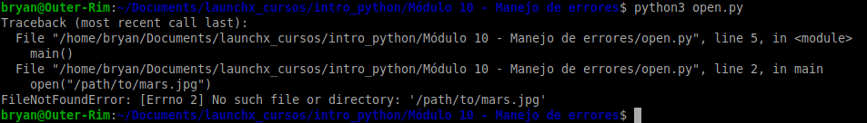
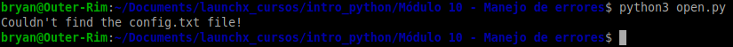
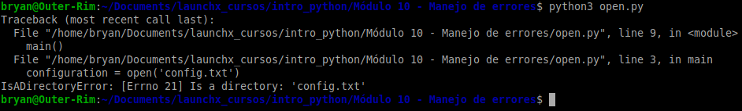
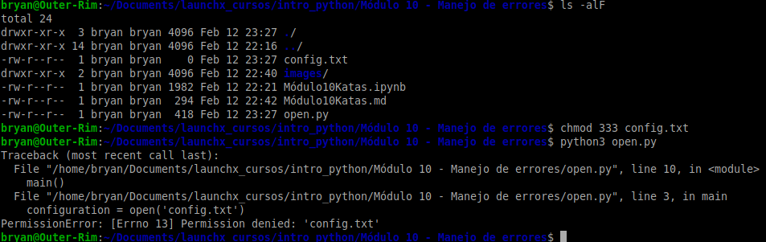
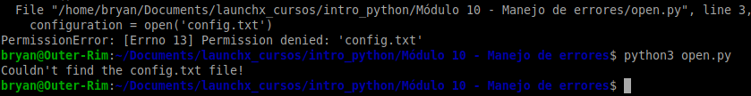
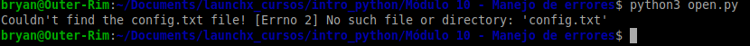
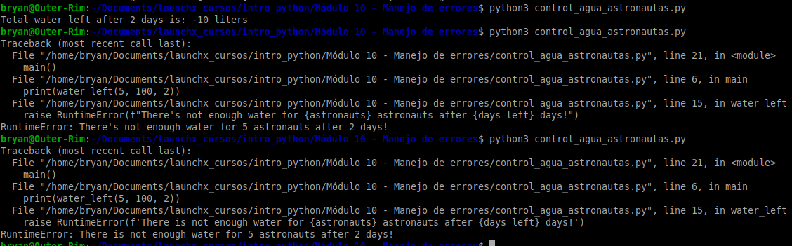
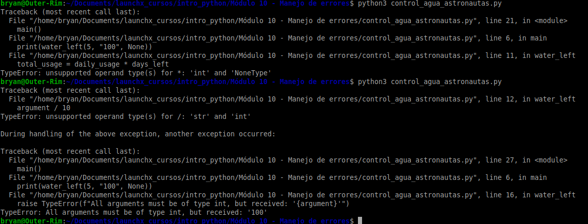

# Manejo de errores

### Tracebacks

## Controlando las excepciones

### Try y Except

### Convertir archivo config.txt a carpeta

### Error de permisos en archivo

### Despues de eliminar archivo config.txt

### Cuando la excepcion es muy generica, el mensaje de error puede util

## Control de agua para astronautas

### Se arroja un RuntimeError en caso que el nivel de agua sea muy bajo

### Validacion de tipos de argumentos, para mostrar un mensaje de error mas descriptivo
